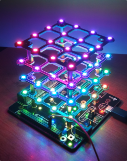
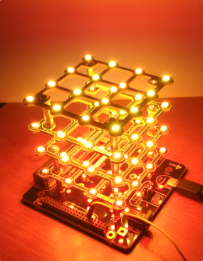
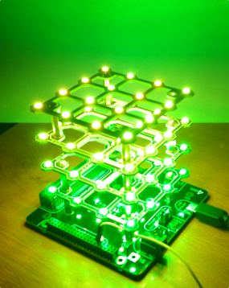
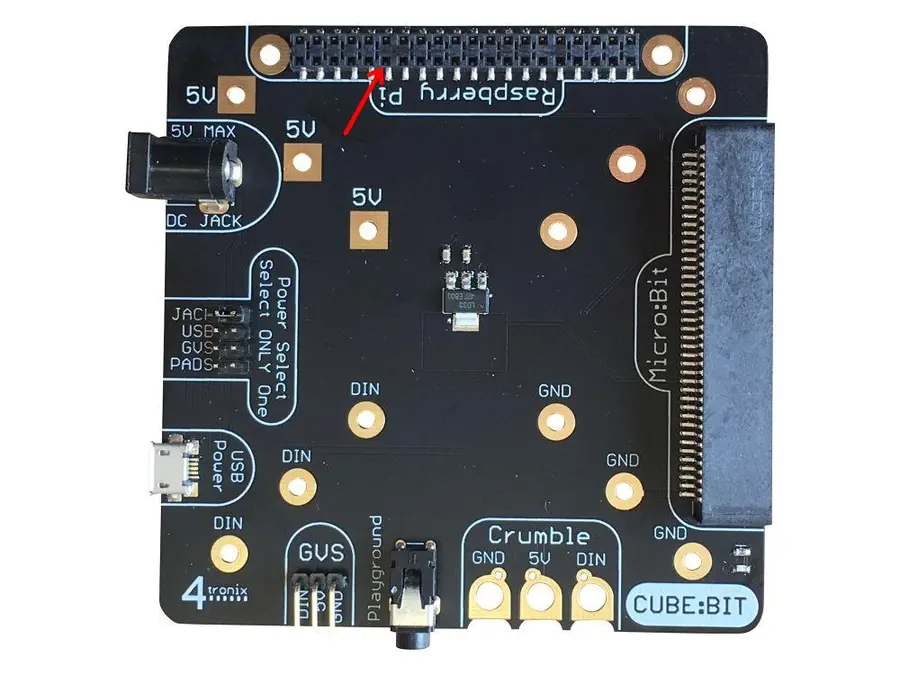

Some visual effects for the Cube:bit board from 4tronix.
It's basically a strip of RGB LEDs (SK6812 aka WS2812 clones)
controlled by an ESP microcontroller from Espressif.

## Demo

<div align="center"><figure>
    <br>
    <figcaption>Rainbow</figcaption>
</figure></div>

<div align="center"><figure>
    <br>
    <figcaption>Random</figcaption>
</figure></div>

<div align="center"><figure>
    <br>
    <figcaption>Red fire</figcaption>
</figure></div>

<div align="center"><figure>
    <br>
    <figcaption>Green fire</figcaption>
</figure></div>

<div align="center"><figure>
    <br>
    <figcaption>Matrix</figcaption>
</figure></div>

## Installation

Edit the file `include/commons.h` to update some variables:

```c
#define LED_STRIP_GPIO         GPIO_NUM_8 // GPIO connected to the WS2812
#define LED_STRIP_LED_COUNT    64         // Total number of LEDs
```

Connect the choosen GPIO to the board. DO NOT connect it to the DIN pins.
These pins use a voltage pulled-up to 5V, not 3.3V.
Such voltages are dangerous for the GPIOs of all microcontrollers in the ESP family.
A basic voltage level translation circuit (N-MOSFET, BSS138) should be included
for this purpose on the board for compatibility with the Raspberry Pi and Micro:bit devices.

So you will have to use the pin 12 of the RPi port on the board:

<div align="center"><figure>
    <br>
    <figcaption>Use the pin 12</figcaption>
</figure></div>

## Compilation

```shell
$ pio run -e release
```

## Flash

```shell
$ pio run -e release -t upload
```

## License

Released under the AGPL (Affero General Public License).
